## Introduction

Somes years ago I brought a new car radio with “radio, usb, SD, aux” to be able to listen to the radio or my music, depending on my mood. I quickly noticed that the radio had a poor reception quality.

As I did not want to buy an other new “high quality” car radio I decided to modify an old one, with a very good reception quality and add a jack so that I can listen to the music from my smartphone.

So I brought an old Clarion 882NP for 2€.

The radio reception is very good, automatic channel research and automatic saving of the channels with the best reception. Very easy to use, it has only the necessary.

It also has a tape player and this is going to be very useful to modify the radio. We will use the tape audio entry and solder the jack on it.

## Steps

### Open and solder the jack

After opening the thing we see what is interesting for us: the cable with 3 wires. It comes from the tape head and goes to the amplifier. By soldering the jack cable in place of the tape head it will be possible to listen to the music coming from the jack when the radio is in tape mode (when a tape is in the tape player and not at the end).

Lets try. First prepare the jack cable (I got mine from old headphones). To remove the insulation (blue and red) just burn it with a lighter.

Now solder the cable in place of the tape head.

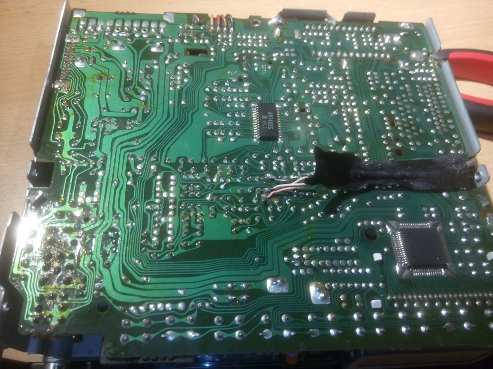{ width=32% }
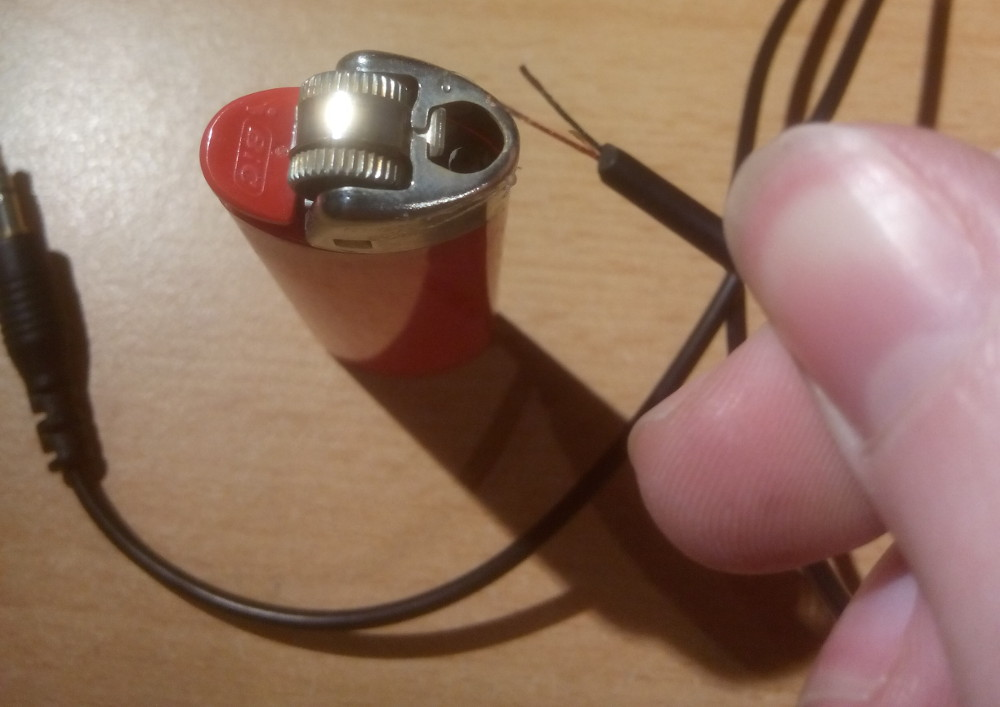{ width=32% }
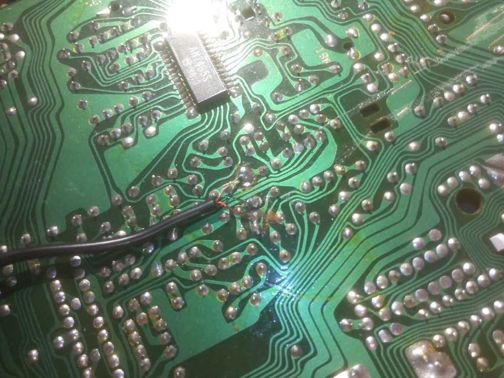{ width=32% }

### Try if it works

To do so, we need to put a tape and music on the jack.

Works! Don’t put the sound of the smartphone to high, otherwise the sound will be saturated, but it works fine! (the saturation comes from the pre-amplifier dedicated to the tape head. You can remove this one if you now what you’re doing)

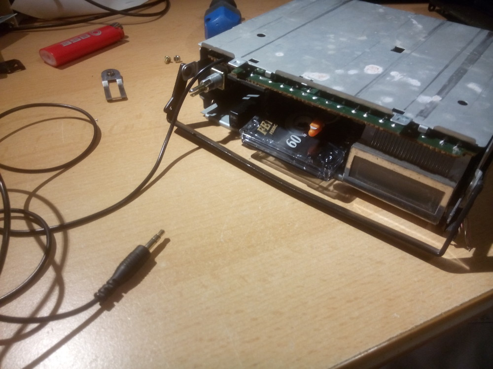{ width=32% }
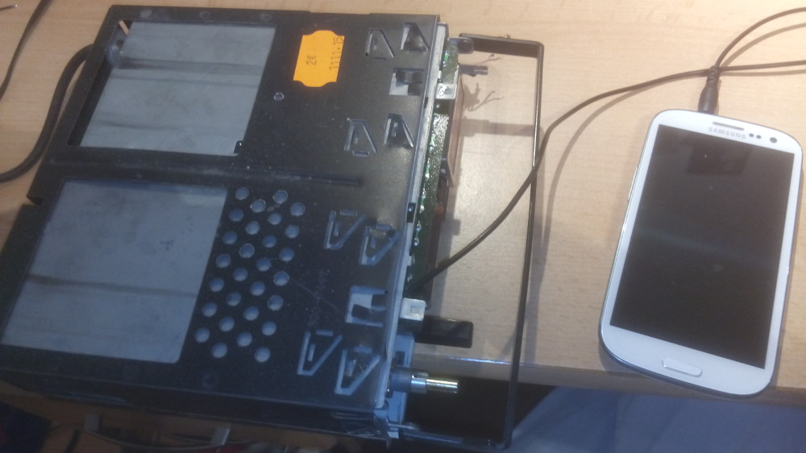{ width=32% }

### Glue the solder points

Put some hot glue on the solder points to avoid short-circuits.

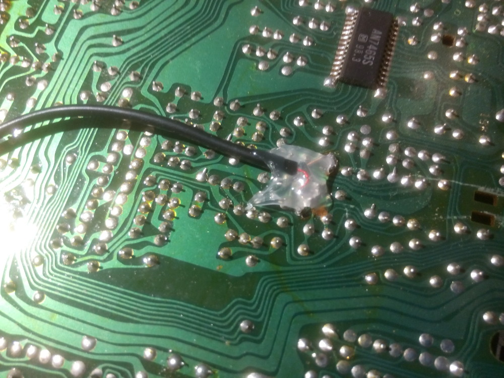{ width=32% }

### Modify the mechanism to be able to use it without a tape

Okey, it works, but it is necessary to put a tape in the player to listen to the music coming form the jack and once the tape is finished we will have to put the tape in the other way back in the player. A bit to vintage for me. Lets take a look a the mechanism to modify it and be able to use the “eject” button to switch between “radio” and “tape” mode, without a tape.

There are two buttons for two functions:

* one for the tape detection
* the other one to detect the tape end

Lets ignore the “tape end” button and try to understand how the inserting of the tape works. The modifications are quite complex to explain by text, so I took a photo of the parts which I removed and where they came from.

Also cut the motor supply to avoid unnecessary noise.

After that remove the plastic “eject” button and glue it back at the same position but without pushing it to the maximum. This way it is possible to pull it when you want to switch to “tape” mode and push it to go to “radio” mode.

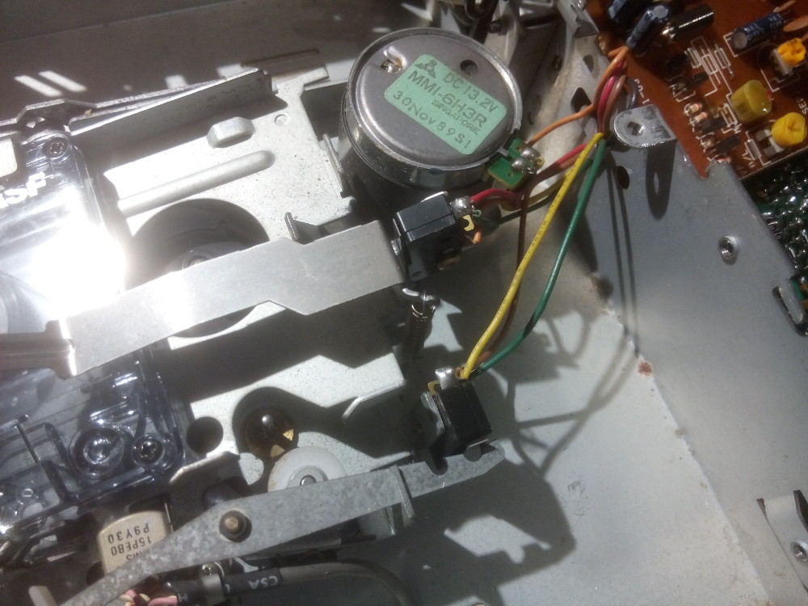{ width=32% }
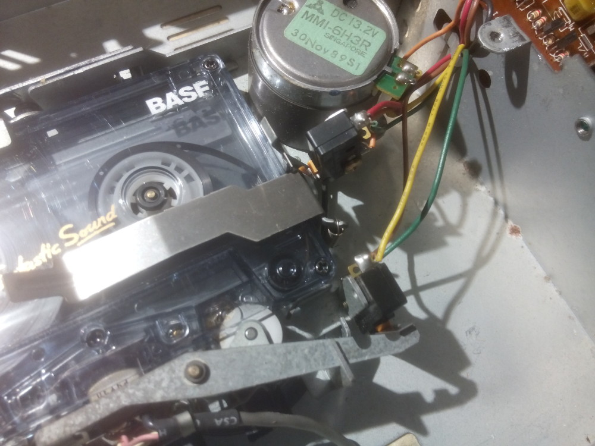{ width=32% }
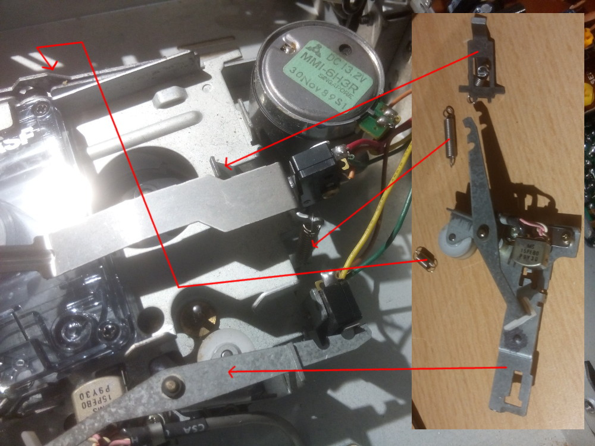{ width=32% }
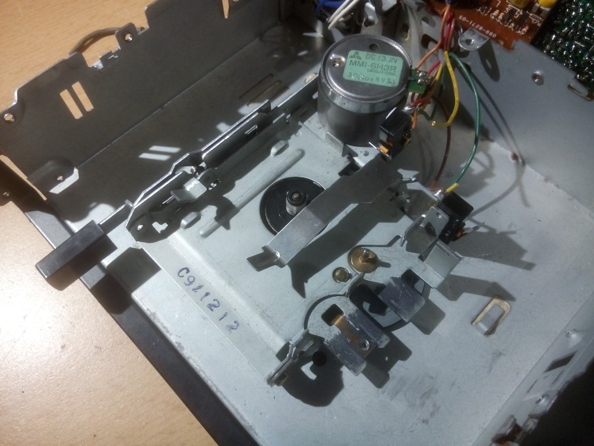{ width=32% }

## Result

Remount everything and you get a car radio with audio input!

Pull the "eject" button to listen to the jack, push it to listen to the radio!

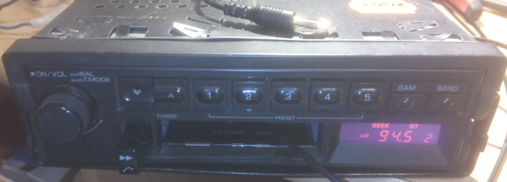{ width=32% }
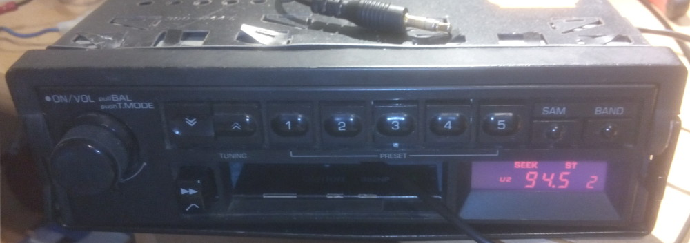{ width=32% }

## Updates

### Bypass the pre-amplifiers

After a few days using the radio, I noted that the sound on the jack was noisy. To avoid this it is necessary to bypass the pre-amplifiers initially used for the tape head.

So I disassembled the radio again and searched for theses. To do so I followed the coper traces on the board and the components (a capacity and a resistance used as a filter) to arrive at the operational amplifiers. Reading the datasheet gave me the output pin. Then I just needed to cut the pin and solder the audio input here (2x: left and right).

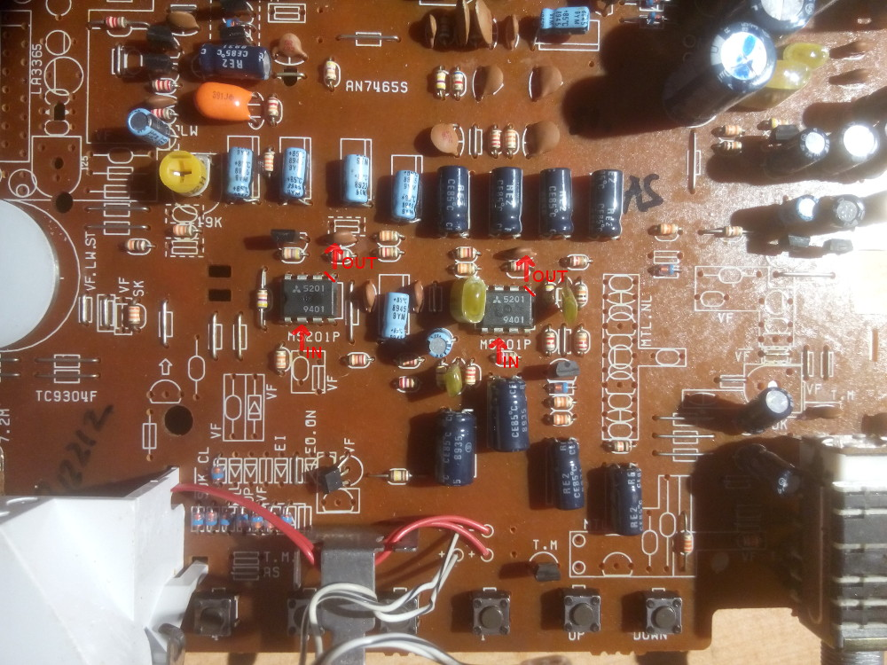{ width=32% }
{ width=32% }

### Change the back light

As the radio was open I decided to change the old back-light of the buttons and display. I used 12V LED lights brought on ebay.

For the back-light of the display some adjustments where made on the plastic so that the led fits nicely.

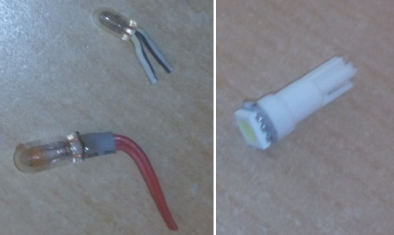{ width=32% }
{ width=32% }
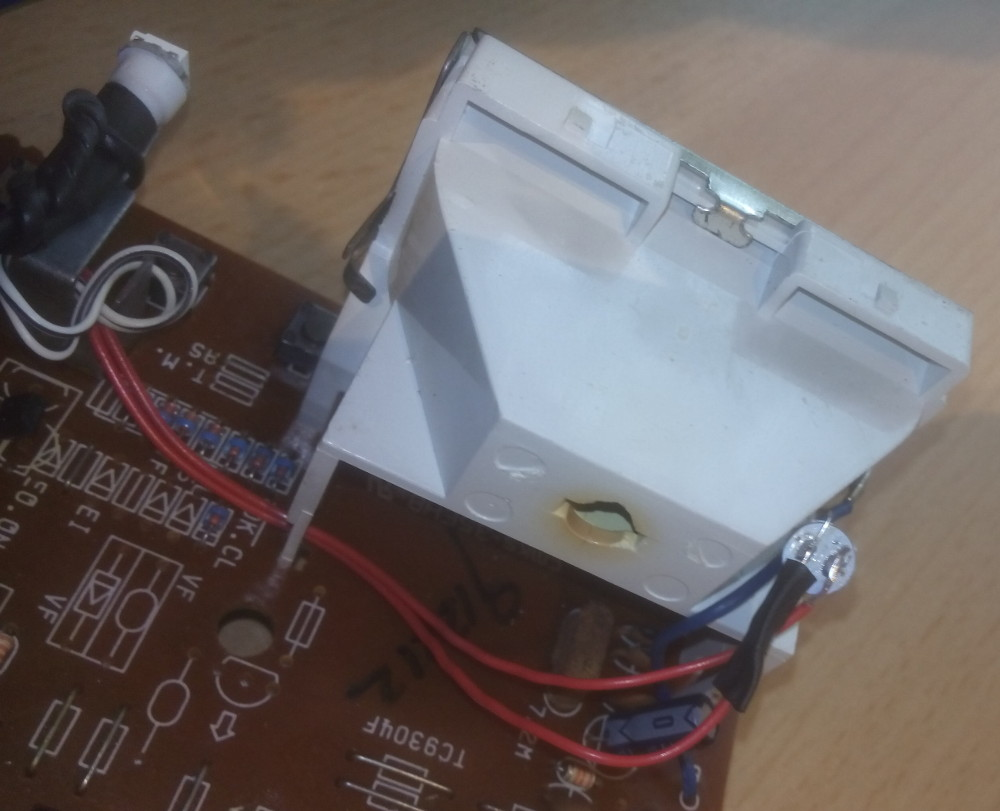{ width=32% }
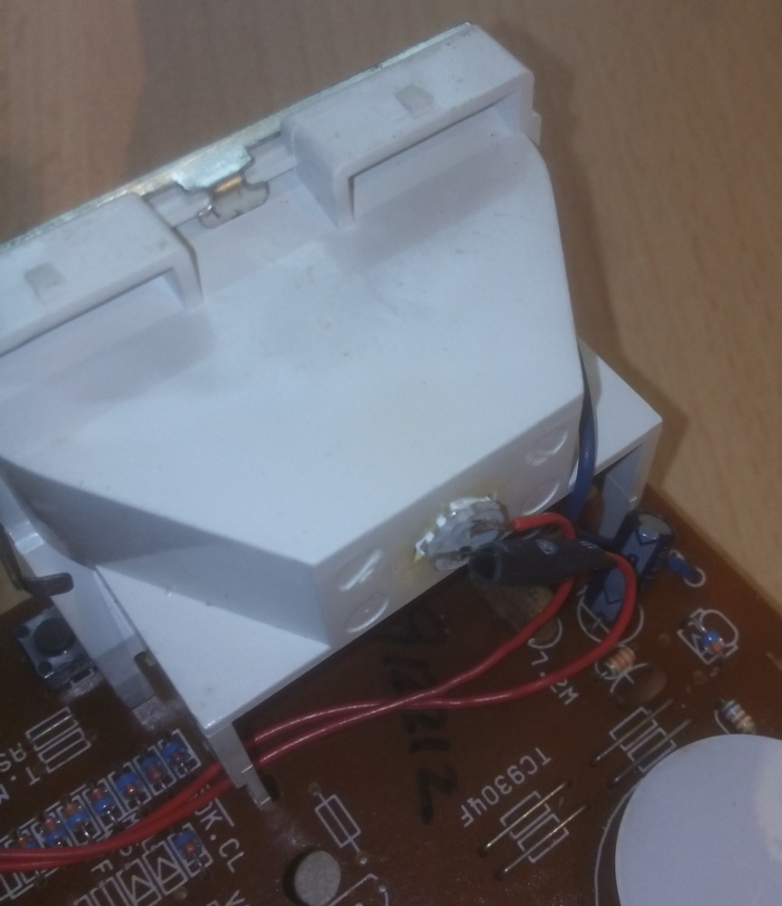{ width=32% }

This article has also been posted on [instructables](https://www.instructables.com/Add-a-Audio-Jack-to-an-Old-Car-Radio-Clarion-882NP/){ target="_blank" }.