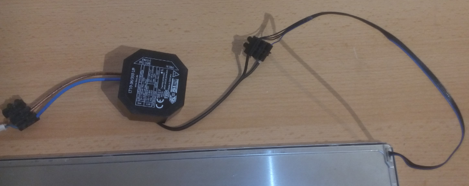
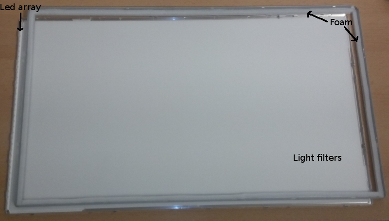
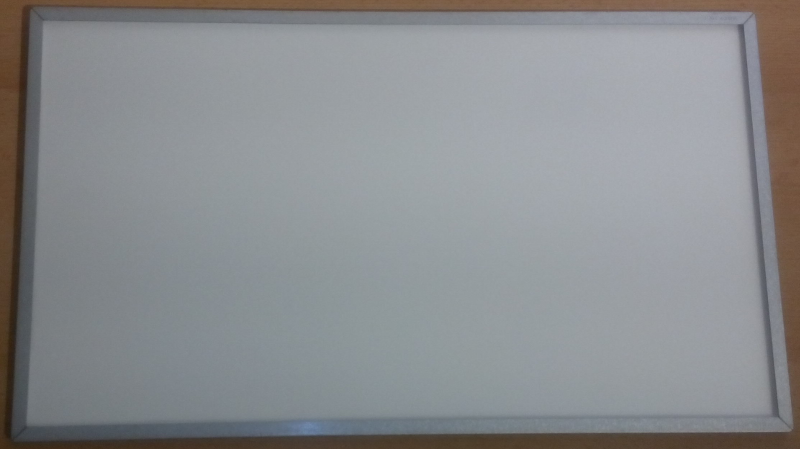
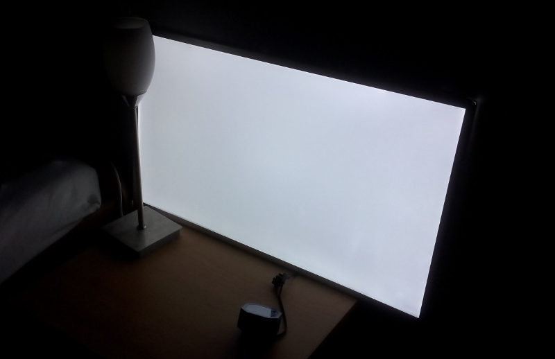

## Introduction

Do you have a broken display at home? Need a new light?!

Reuse the back light of your broken display!

I had a Samsung 22" panel, LCD was broken, so I decided to transform it into a light source.

First steps are simple: open the display, get the display panel out of the plastic, and remove the LCD. (sorry I don't have any picture of those steps)

## Steps

### Read the datasheet of the display

First thing to do is to read the datasheet in order to know of the back light system works.

In my case I have a Samsung LTM230HT10, I found the datasheet easily on duckduckgo (or google).

The datasheet gives us informations about the back light system:

- LED Forward Current: 360mA
- LED Array Voltage: 35,2V
- Panel is made of 33 LEDs in 3 arrays of 11 serial LEDs
- Connector is made of 1 Vin and 3 returns (GND)

So, the power of the LEDs is: P = I x V = 0,360A * 35,2V = 12,6W

### Find the right power supply

Now that I have all the useful informations about my LEDs we need to chose the right power supply. LEDs should always be current driven with a current source that gives always constant current (CC). Those power supplies are quite expensive and hard to find compared to constant voltage (CV) ones. So I took my time to find a CC supply with following characteristics:

- constant current around 360mA
- Maximum forward voltage of at least 35V

I finally found the Friwo LT10-36/350 UP with following characteristics:

- constant current: 350mA
- Forward voltage: 8-36V
- Efficiency: 84%
- Input: 220V-240V AC
- cost: ~25€

Quite low cost, small form factor, 220V input, perfect for a light source!

{ width=100% }

### Make the optical layers hold in place

Last thing to do in order to use this new light source on a ceiling: the different parts (light filters etc) must hold in the case. Before I modified the screen they where held in place by the LCD screen. In order to hold them in place I taped some foam as shown on the picture.

Note: I removed one of the filter (the upper one) because it had a wired light effect. Removing it made the light source more wide.

{ width=45% }
{ width=45% }

## Result

The result is very good. 12 W of Led is quite powerful (even if the picture does not shows it). This light is intense but does not burn the eye as direct leds do. The light is very white compared to “classic” lights.

{ width=100% }

This article has also been posted on [instructables](https://www.instructables.com/Turn-a-broken-22-display-into-a-light-box/){ target="_blank" }.