## Introduction

Today we will transform a broken 80cm LCD TV into a remote controlled light box for light therapy.

I brought the TV for cheap money as the LCD was broken. The TV used LED technology for the back light and everything worked fine. It's form a Chines brand "HARROW", nothing special. 

## Steps

### Open the TV

The first step: open the thing: very simple, unscrew the screws ...
That is how it looks like inside.

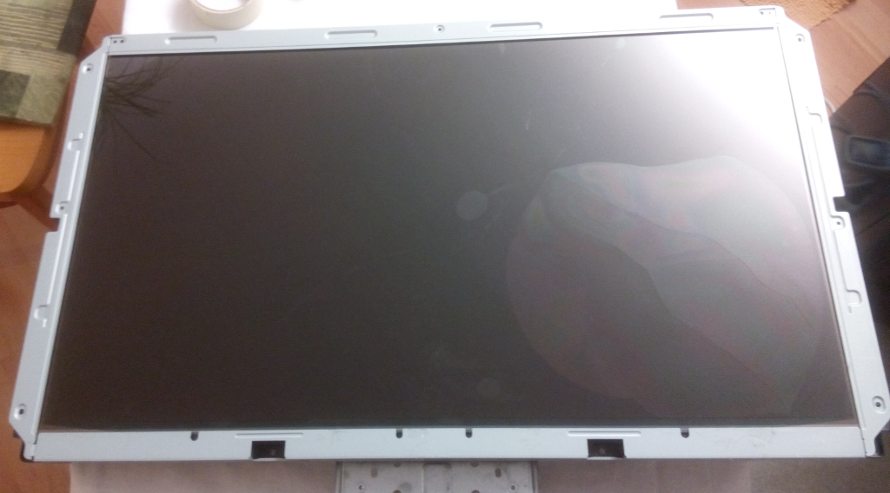{ width=45% }
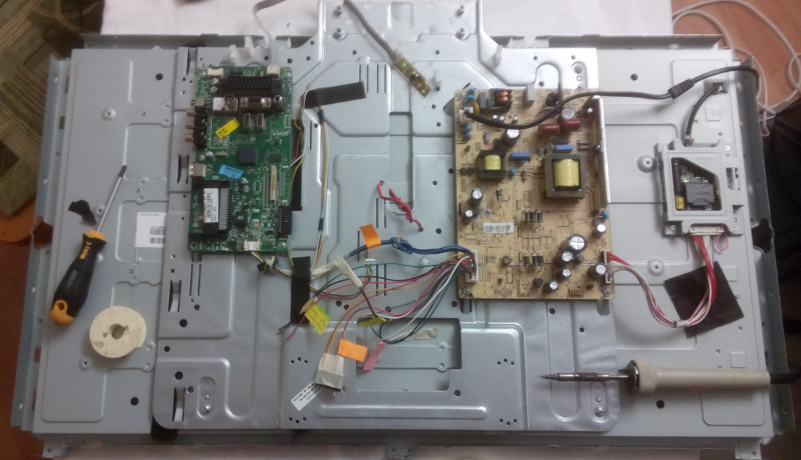{ width=45% }

### Remove the LCD panel

Now we need to remove the LCD panel and only keep the back light system.

To do this we need to disconnect the LCD panel from the main board and unscrew the screw that hold the LCD in place (the metal bars on the sides). Now we can see the back light system, which is basically just a white surface.

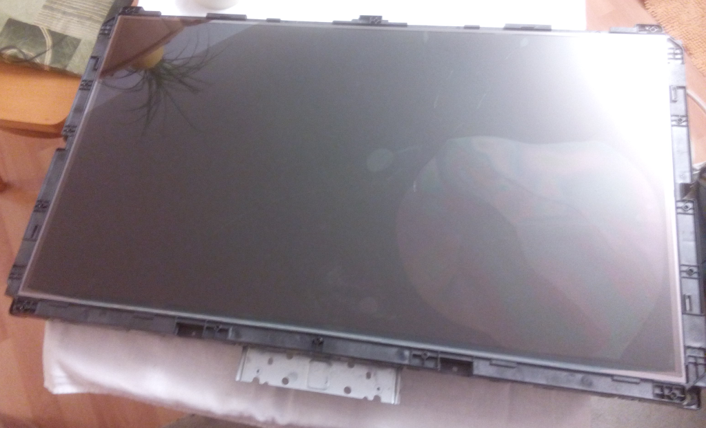{ width=45% }
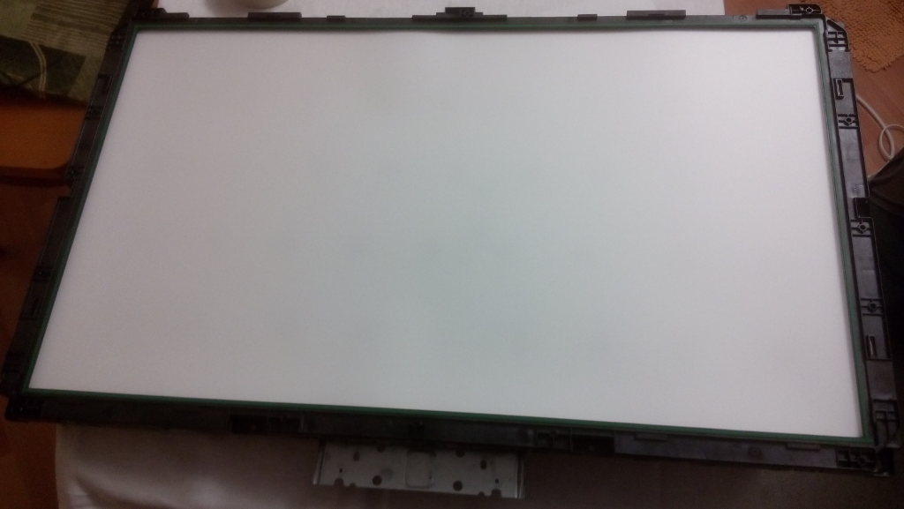{ width=45% }

### Hack the brightness control system

When you use you're TV as usual you can control the brightness with the remote control. As we don't have access to the configuration screen any more (as we don't see it ...) if we want to use the full power of the back light we need to hack the control system.

To do that I first checked the datasheet of the panel. My panel is a LG LC320DXN. You can find the data sheet easily on duckduckgo or google.

Going to the back light module specification shows us that the back light power is controlled by a PWM pin on the inverter board. There is also a pin to enable/disable the entire panel.

If we always want the maximum power out of the LEDs we simply need to put always a high logic level on the PWM pin. So I simply cut the PWM cable and soldered it on the enable/disable pin. If the panel is on the enable/disable pin will have a logic level high (5.0V) and so the PWM will be at maximum.

On the board, the pink wire is the PWM wire, just cut it and solder it on the enable/disable pin, here the gray one.

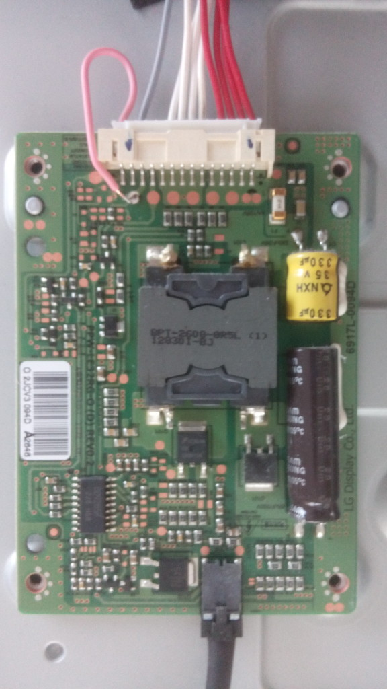{ width=45% }

## Result

Now what do we have? A remote controlled light source!! Yes, it you power up everything again, the TV will light up as usual if you use the remote control. Of course the TV does not know the LCD is not connected any more!

As we hacked the brightness system the light power will be at maximum all the time.

50W of LED is quite powerful!

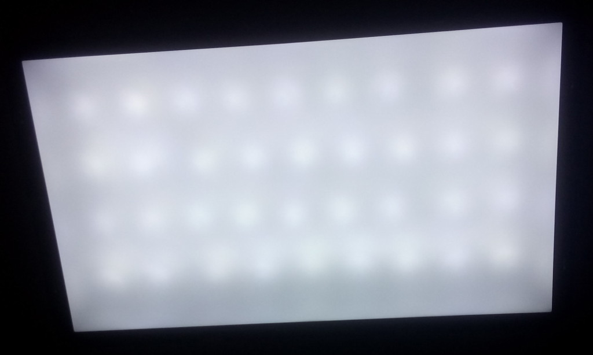{ width=45% }
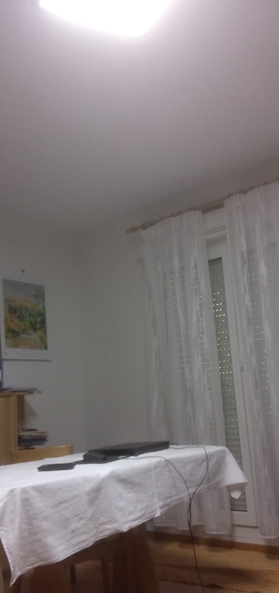{ width=45% }

## Updates

### A deeper look inside

Just to see how it is made inside I took a deeper look inside. If you remove the black platic holding the back light system together you will be able to see 4 optical layers. (on my photo there are only 3, I removed the upper one because it's kind of a polarizing filler only useful for the LCD panel). The last layer is a 3 mm white platic pane and
the 2 upper ones are translucent paper to make the light as uniform as possible.

If you remove them you will finally see the LEDs.

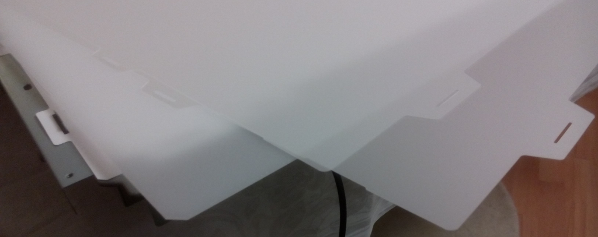{ width=32% }
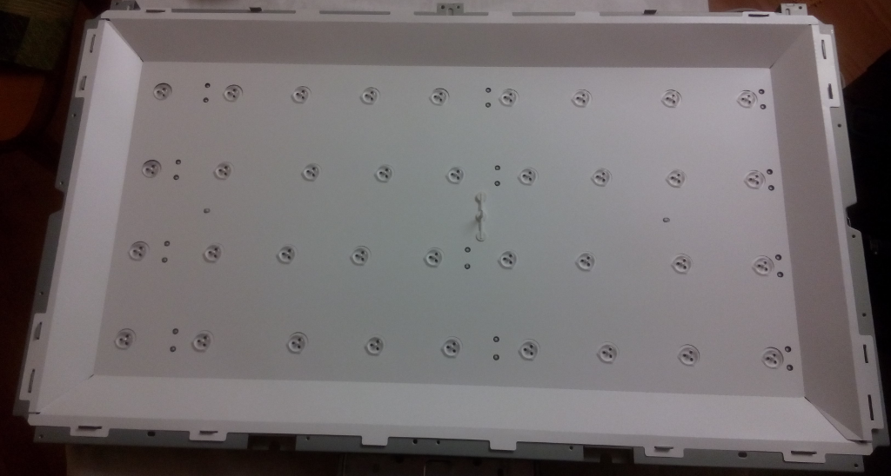{ width=32% }
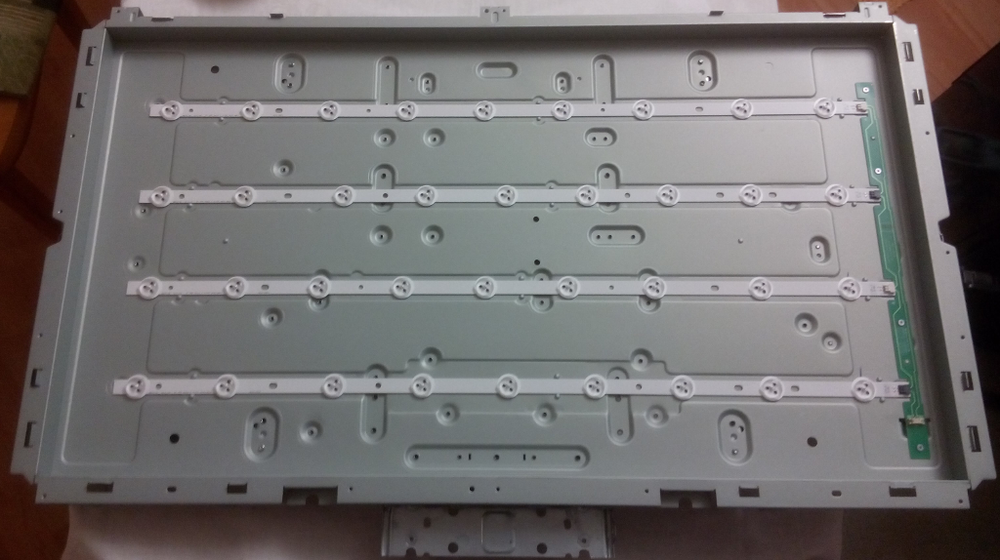{ width=32% }

### Remove the remote control to use a wall interrupter

Okey, this is pretty cool but useless when you want to use the wall interrupter as with usual lights. So lets take a look at the back of the screen: There are 2 boards: the green one for the logic and the beige one is the power supply. We need to get rid of the green one and to do that we need find the different enable pins on the power connector between the two board.

This is quite complicated and I would not recommend you to do this if you’re not sure about what you’re doing. Keep in mind that there are life dangerous voltages in game. I checked the different cables with a multi-meter and found out 4 cables:

-one delivering a 3.0V – 4.0V unstable voltage when the power supply is on standby and 5.0V if the power supply is enabled

-one that if connected to 3.3V enables the power supply

-one that if connected to 3.3V enables the back light

If we connect them together we have:

-the power supply enabled

-the back light enabled

and finally it works as a usual light: put 220V on the power supply and it will light up!

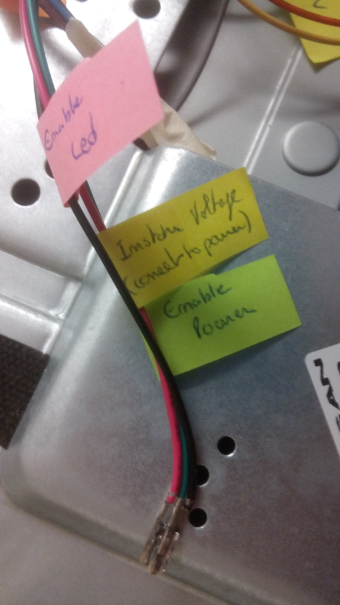{ width=45% }

This article has also been posted on [instructables](https://www.instructables.com/80cm-broken-LED-TV-turned-into-50W-remote-controll/){ target="_blank" }.