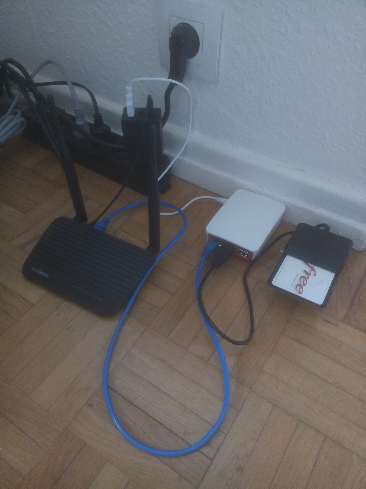

## Introduction

Depuis quelques années Free à mis en place des réseaux sans fils pour ces abonnés mobiles. Chaque FreeBox installé dispose et émet un signal wifi « FreeWifi_secure » sur lequel il est possible de ce connecter via son smartphone. Pour la connexion, nul besoin d’identifiants, ceux-ci sont contenus dans la carte SIM (Free donc) du téléphone. Il est ainsi possible de profiter d’une bonne connexion internet sur l’abonnement à 2€ par mois sans passer par la 3G, à condition d’avoir une borne « FreeWifi_secure » dans les parages.

Pour des besoins temporaires je voulais me connecter à l’un de ces réseaux pour refaire mon propre réseaux sans fils (disponibles pour plusieurs pc et smartphones). Mon but étant d’utiliser le réseau « FreeWifi_secure » en tant que point d’accès internet.

## Prérequis

Pour ce faire, il va me falloir à minima:

* Un abonnement Free mobile 2€ et la carte SIM
* un réseau « FreeWifi_secure »
* un ordinateur
* une carte wifi
* un lecteur de carte sim
* un routeur wifi pour mon réseau sans fil privé

Pour l’ordinateur, il me fallait quelque chose de compact. Je me suis donc tourné vers un Raspberry Pi 3 B. Abordable, facile à configurer, celui-ci dispose d’une carte Wifi intégré. Pour qu’il fonctionne il lui faut encore une carte MicroSD de 8go ou plus et une alimentation 5V (2A).

Pour le lecteur de carte SIM je me suis en premier lieu tourné vers un modèle à 2$ Chinois disponible sur ebay. Malheureusement celui-ci est avéré défectueux et j’ai donc investi dans un lecteur de Smart-Card plus cher, le Cherry TC-1100, ma principal contrainte étant que celui-ci devait être compatible avec Linux.

Pour le routeur, n’importe quel routeur sans fils avec une prise Ethernet devrait faire l’affaire.

{ width=32% }

## Installation

La première chose à faire est d’installer un système d’exploitation sur le Raspberry Pi. J’ai choisi Raspbian Lite. Le guide d’installation complet est ici.

Pour ma part je copie l’image de Raspbian sur la carte SD:
```
sudo dd bs=4M if=2017-04-10-raspbian-jessie-lite.img of=/dev/mmcblk0
```
La carte SD est prête. Avant de démarrer le Raspberry il me faut encore activer l’acces à distance via SSH car je n’ai pas d’écran. Pour ce faire il faut créer un fichier « ssh » sur la partition « boot ».

Ensuite j’ai besoin d’une adresse IP fixe pour me connecter plus tard à mon Raspberry via SSH. Pour ce faire, il faut éditer le fichier:
```
sudo nano /etc/network/interfaces
```
et ajouter/modifier les lignes concernant « eth0 » pour avoir la chose suivante:
```
auto eth0
iface eth0 inet static
    address 192.168.1.1
    netmask 255.255.255.0
```
On peux maintenant mettre la carte SD dans le Raspberry qui sera accessible via l’adresse 192.168.1.1.
Configuration
Désactiver la carte Wifi intégré (optionnel)

Pour certaines raisons on peut vouloir utiliser une carte Wifi externe au quel cas on peut désactiver la carte Wifi intégré au Raspberry Pi (3 B uniquement):
```
sudo nano /boot/config.txt

dtoverlay=pi3-disable-wifi
```
Désactiver l’IP V6

De coutume je n’utilise jamais l’IP V6 et le désactive donc pour simplifier le reste de la configuration:
```
sudo nano /etc/sysctl.conf

net.ipv6.conf.all.disable_ipv6 = 1
net.ipv6.conf.default.disable_ipv6 = 1
net.ipv6.conf.lo.disable_ipv6 = 1
net.ipv6.conf.eth0.disable_ipv6 = 1
net.ipv6.conf.wlan0.disable_ipv6 = 1
```

## Mise à jour et installation des logiciels

Connecter maintenant votre Raspberry Pi à internet pour faire les mises à jours et installer les logiciels nécessaires au bon déroulement des opérations.
```
sudo apt-get update
sudo apt-get upgrade

sudo apt-get install pcscd pcsc-tools libccid iptables-persistent
```

## Test du lecteur de carte

Élément crucial, le lecteur de cartes. On vient d’installer les logiciels nécessaires à sont bon fonctionnement, il faut maintenant tester:
```
sudo pcsc_scan
```
La commande devrait afficher quelque chose comme ça:
```
PC/SC device scanner
V 1.4.23 (c) 2001-2011, Ludovic Rousseau <ludovic.rousseau@free.fr>
Compiled with PC/SC lite version: 1.8.11
Using reader plug'n play mechanism
Scanning present readers...
0: Cherry Smart Card Reader USB (OKCM0030407140701284559729565853) 00 00
```
Si ce n’est pas le cas, le lecteur de carte n’est pas reconnu et il va falloir chercher pourquoi… Bonne chance!

Si tout à fonctionner correctement on peut insérer la carte SIM dans le lecteur et on devrait voir s’afficher quelque chose comme ça:
```
Card state: Card inserted, Shared Mode
```

C’est très bon signe!

## Configuration Wifi

Il nous faut créer un fichier de configuration pour wpa_supplicant:
```
sudo nano /etc/wpa_supplicant/FreeWifi.conf

cred={
  imsi="none" # anything but blank value
}
network={
  #bssid=MACADRESS #A Ajouter si plusieurs reseaux sont disponibles et que l'un est meilleur
  ssid="FreeWifi_secure"
  key_mgmt=WPA-EAP IEEE8021X
  eap=SIM
  pin="1234" #Code de la carte SIM par defaut
  pcsc=""
}
```
On peut maintenant essayer de ce connecter au réseau:
```
sudo iwconfig wlan0 essid "FreeWifi_secure" && sudo wpa_supplicant -i wlan0 -d nl80211 -c /etc/wpa_supplicant/FreeWifi.conf -B
```
(il vous faudra peut-être régler -d selon vote carte wifi)

Si tout a fonctionner correctement vous devriez avoir une adresse IP et devriez être capable de pinger 8.8.8.8 sans avoir internet sur la partie Ethernet de votre Raspberry.

On peut alors configurer les interfaces pour que le Raspberry se connecter automatiquement au réseau Wifi lors du démarrage de celui-ci:
```
sudo nano /etc/network/interfaces
```
Modifier les lignes concernant wlan0:
```
allow-hotplug wlan0
iface wlan0 inet dhcp
    wpa-driver nl80211
    wpa-conf /etc/wpa_supplicant/FreeWifi.conf
    wireless-power off
```
Il faut peut-être régler  wpa-driver selon votre carte wifi.
```
sudo reboot
```
On vérifie avec iwconfig et ifconfig si tout est ok.

## Mécanismes periodiques

A ce stade, vous devriez avoir internet sur votre Raspberry Pi via la connexion « FreeWifi_secure ». Mais il y a un bemol… Vous vous rendrez rapidement compte qu’au bout de 30 minutes maximum vous n’aurez plus accès à internet. C’est parce que le wifi « FreeWifi_secure » doit recevoir des informations d’authentifications toutes les 30 minutes, sinon il coupe l’accès à internet. Heureusement il existe une commande pour renvoyer les informations d’authentifications sans pour autant ce déconnecter du réseau wifi:
```
sudo wpa_cli reauthenticate
```
Si vous exécuter cette commande, vous verrez la led du lecteur de carte SIM clignoter. Le logiciel est donc aller lire les informations d’authentifications sur la carte SIM et les a envoyer au spot « FreeWifi_secure ».

Pour être sur de ne pas perdre la connexion internet il faut exécuter cette commande au moins toutes les 30 minutes. 15 minutes c’est plus sur, et ça ne coûte pas bien cher. Pour ce faire nous utiliserons l’utilitaire crontab.
```
sudo crontab -e
```
s’ouvre alors un éditeur de texte dans le quel il faut ajouter la ligne suivante:
```
*/15 * * * * sudo wpa_cli reauthenticate >/dev/null 2>&1
```
Si vous avez la patience, vous verrez la led du lecteur de carte clignoté toutes les 15 minutes.

Internet devrait être beaucoup plus stable maintenant et vous devriez pouvoir profiter d’internet pendant plus de 30 minutes d’affiler sans déconnexion.

Mais mais mais, il se peut que de temps à autres, pour X raisons, ça ne fonctionne plus. C’est pourquoi j’ai crée un script chargé de vérifier l’état de la connexion et de régler les problèmes si l’accès à internet est perdu.
```
sudo nano CheckInternet.sh

#!/bin/bash
up=true

for i in {1..24}
do
        if $up ; then
                pingGoogle=`ping 8.8.8.8 -I wlan0 -s 0 -c 3 -i 1 >>/dev/null; echo $?`
                if [ $pingGoogle -eq 0 ]; then
                        echo up
                else
                        date +%s >> /home/pi/dhclient.log
                        #echo Internet is down >> /home/pi/dhclient.log
                        up=false
                        wlan=`iwconfig wlan0 | grep "FreeWifi_secure" | wc -l`

                        if [ $wlan -eq 0 ]; then
                                echo wlan disconnected >> /home/pi/dhclient.log
                                sudo ifdown wlan0
                                sudo ifup wlan0
                        else
                                echo reinit dhcp client >> /home/pi/dhclient.log
                                sudo dhclient -r wlan0
                                sudo dhclient wlan0
                        fi
                        sudo wpa_cli reauthenticate
                fi
        fi
done

sudo chmod +x CheckInternet.sh
```
On peut tester le script en exécutant celui-ci:
```
sudo ./CheckInternet.sh
```
Le script va pinger google 10 fois. Si tous les pings sont perdus l’accès internet est perdu, mais normalement la connexion à la borne wifi est toujours bonne. Il suffit alors de demander une nouvelle IP: les deux lignes dhclient s’en charges.

Ce script s’exécute toutes les minutes:
```
sudo crontab -e

*/1 * * * * sudo bash /home/pi/CheckInternet.sh >/dev/null 2>&1
```
On a maintenant une connexion internet fiable, qui est automatiquement vérifié.

## Redirection du trafic vers le port Ethernet

C’est bien beau tout ça, mais moi ce que je voulais c’était avoir mon propre réseau wifi, accessible par tous mes objets (pc, smartphones, …) en même temps. C’est bien pour ce que nous disposons d’un routeur wifi. Il sera connecter au port Ethernet du Raspberry. Mais avant cela, il faut dire au Raspberry de rediriger tout le trafic du réseau wifi vers le port Ethernet, et de rediriger les requêtes qui arrive via le port Ethernet vers le réseau wifi.

Première chose a faire, activer la redirection de trafic:
```
sudo nano /etc/sysctl.d/30-ipforward.conf

net.ipv4.ip_forward=1
net.ipv6.conf.default.forwarding=1
net.ipv6.conf.all.forwarding=1
```
Ensuite, écrire les regles iptables:
```
sudo iptables -A FORWARD --in-interface eth0 -j ACCEPT
sudo iptables --table nat -A POSTROUTING --out-interface wlan0 -j MASQUERADE
sudo iptables -I FORWARD 1 -m conntrack --ctstate ESTABLISHED,RELATED -j ACCEPT

sudo iptables-save

# Generated by xtables-save v1.8.2 on Wed Apr  1 20:40:02 2020
*filter
:INPUT ACCEPT [349:30887]
:FORWARD ACCEPT [162:57661]
:OUTPUT ACCEPT [261:30187]
-A FORWARD -m conntrack --ctstate RELATED,ESTABLISHED -j ACCEPT
-A FORWARD -i eth0 -j ACCEPT
COMMIT
# Completed on Wed Apr  1 20:40:02 2020
# Generated by xtables-save v1.8.2 on Wed Apr  1 20:40:02 2020
*nat
:PREROUTING ACCEPT [0:0]
:INPUT ACCEPT [0:0]
:POSTROUTING ACCEPT [0:0]
:OUTPUT ACCEPT [0:0]
-A POSTROUTING -o wlan0 -j MASQUERADE
COMMIT
# Completed on Wed Apr  1 20:40:02 2020

sudo nano /etc/iptables/rules.v4

 

# Generated by iptables-save v1.4.21
*filter
:INPUT ACCEPT [0:0]
:FORWARD ACCEPT [0:0]
:OUTPUT ACCEPT [0:0]
COMMIT
# Generated by iptables-save v1.4.21
*filter
:INPUT ACCEPT [445:55513]
:FORWARD ACCEPT [543:45114]
:OUTPUT ACCEPT [345:50556]
-A FORWARD -m conntrack --ctstate RELATED,ESTABLISHED -j ACCEPT
-A FORWARD -i eth0 -o wlan0 -j ACCEPT
COMMIT
# Generated by iptables-save v1.4.21
:PREROUTING ACCEPT [484:32167]
:INPUT ACCEPT [1:237]
:OUTPUT ACCEPT [17:1323]
:POSTROUTING ACCEPT [1:172]
-A POSTROUTING -o wlan0 -j MASQUERADE
COMMIT
# Completed

sudo reboot
```

## Routeur

Il faut configurer le routeur pour que celui-ci se connecte sur le port WAN à l’adresse configurer précédemment sur le Raspberry, à savoir 192.168.1.1.

C’est tout!

## Sources

https://ohnomoregadgets.wordpress.com/2013/08/28/free-wifi-with-eap-sim-on-a-desktop-computer/

https://www.raspberrypi.org/documentation/installation/installing-images/linux.md

https://www.raspberrypi.org/documentation/remote-access/ssh/README.md

https://wiki.debian.org/NetworkConfiguration#Configuring_the_interface_manually

https://github.com/raspberrypi/firmware/blob/master/boot/overlays/README

https://wiki.debian.org/DebianIPv6#How_to_turn_off_IPv6

https://wiki.archlinux.org/index.php/Internet_sharing