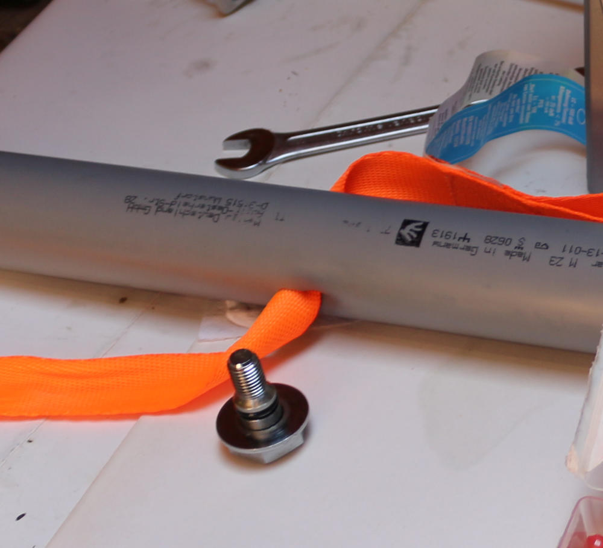
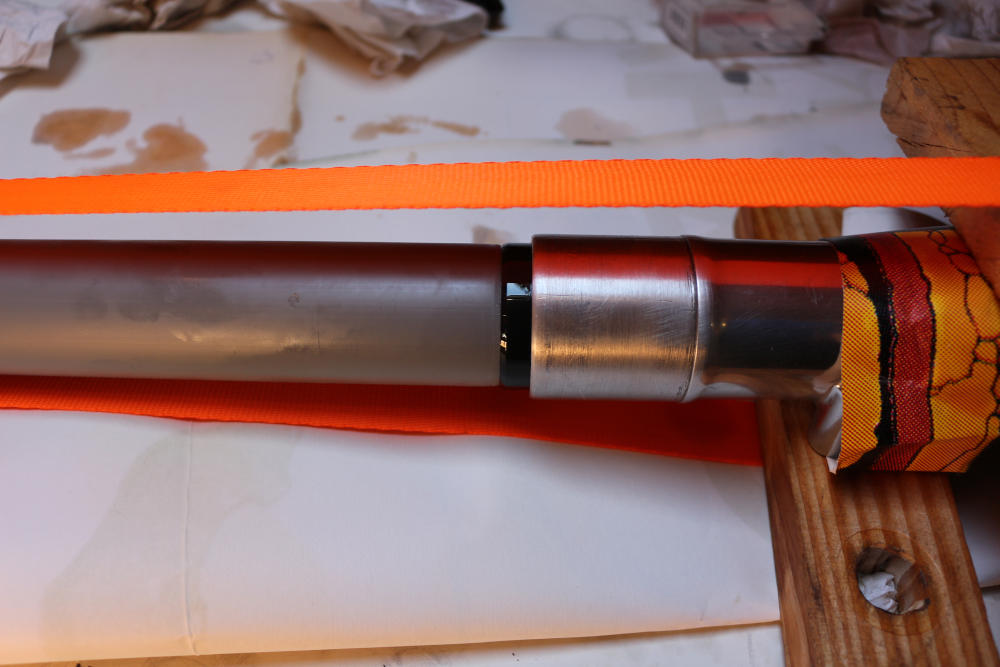
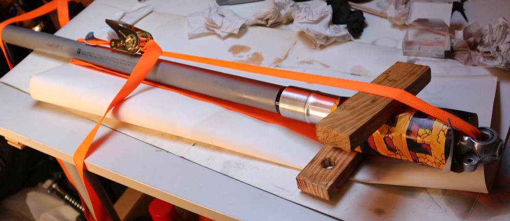
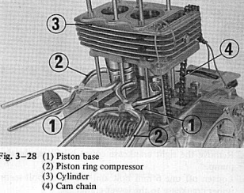
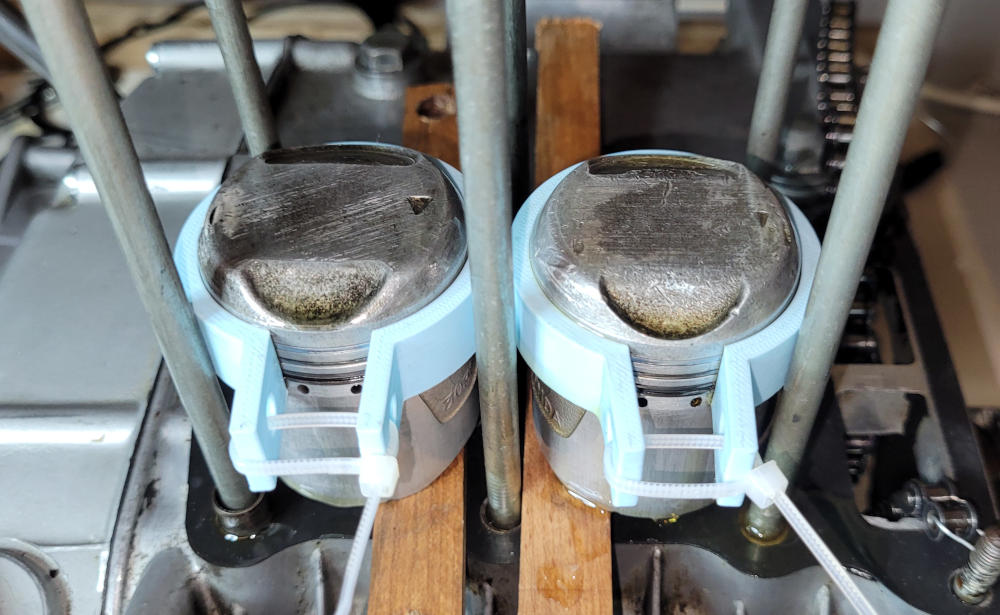
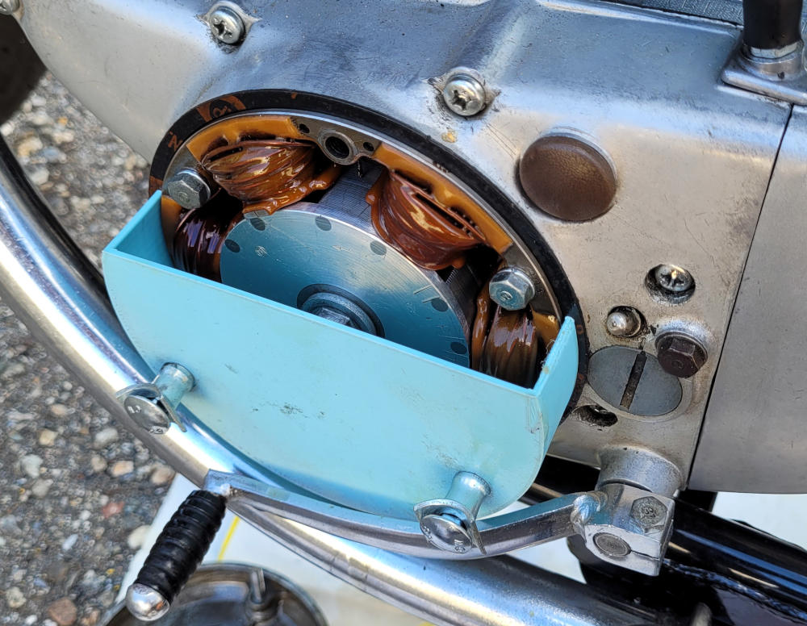

## Introduction

I did restore an old Honda CB125 K4 some time ago and I'm sharing some apsects of the restoration here. Most valuable is probably the [documentation](#documentation) sections where I store all the files I found on internet over the time, including the Workshop manual and the parts list.

## Fork seal assembly

Assembling back the front fork may include changing the oil seals between the fork bottom and the pipe. the manual shop (see [documentation](#documentation)) refers to the **fork seal driver 07947-3550000** tool to this.

I used a 40mm PVC pipe meant for wastewater. You will need a tube longer than the fork pipe, about 1m. Drill a hole at one end of the pipe. This will be used to pull a ratchet strap trough. With the strap go though the fork bottom hole meant for the wheel axle. Adjust everything and use the ratchet to put the seal in position. Be sure to oil all the parts before.

{ width=32% }
{ width=32% }
{ width=32% }

## Piston ring compressor

In order to put back the pistons in the cylinders the manual shop (see [documentation](#documentation)) stipulates the use of a tool named **piston ring compressor 07954-2000000**. As a remplacement to this tool that I don't have I've designed an equivalent object which is 3d printed. It makes it very convinient to put the pistons back as you have both hands free.

{ width=45% }
{ width=45% }

You can find the 3d files on my [Makerworld](https://makerworld.com/en/models/843128-honda-cb125-k4-k5-piston-ring-compressor#profileId-789732){ target="_blank" } profile.

## Ignition timing oil cover

If you want to precisely adjust the ignition timing you will need to use a stroboscopic timing light and you need to see the **F mark** and **Advance mark** of the generator rotor while the engine is running.

You will likely have oil everywhere as the generator rotor is partially immersed in the engine oil. To avoid a mess while doing the adjustment I have designed a 3d printed cover plate.

{ width=45% }

You can find the 3d files on my [Makerworld](https://makerworld.com/en/models/843179-honda-cb125-k3-k4-k5-timing-cover-for-timing-lamp#profileId-789787){ target="_blank" } profile.

## Documentation

I don't remember the sources from where I got all thoses files, sorry for not quoting them.

* [Honda CB125B6 Shop Manual](assets/Honda_CB125B6_ShopManual.pdf){ :download target="_blank" }
* [Honda CB125K5 Parts List](assets/Honda CB125K5 Parts List.pdf){ :download target="_blank" }
* [Honda CB125K5 Revue Moto Technique](assets/Honda CB125K5 Revue Moto Technique 7.pdf){ :download target="_blank" }
* [Honda CB125K5 Electrique](assets/Honda CB125K5 Electrique.pdf){ :download target="_blank" }
* [Honda CB125K Manuel utilisateur](assets/Honda CB125K Manuel utilisateur_light.pdf){ :download target="_blank" }