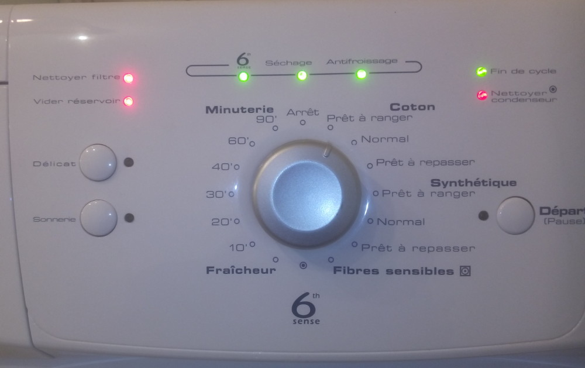
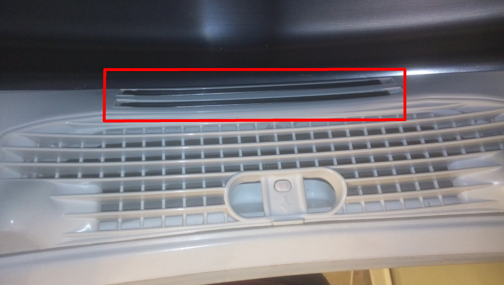
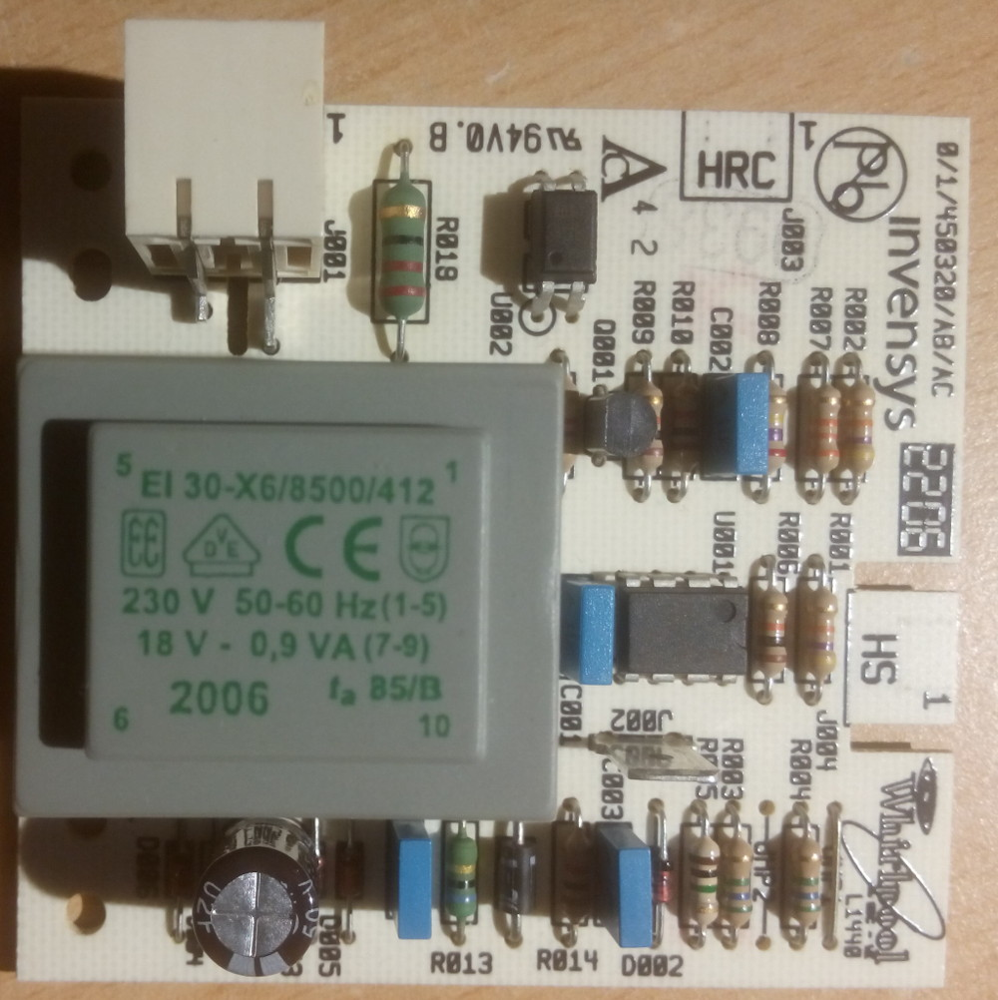
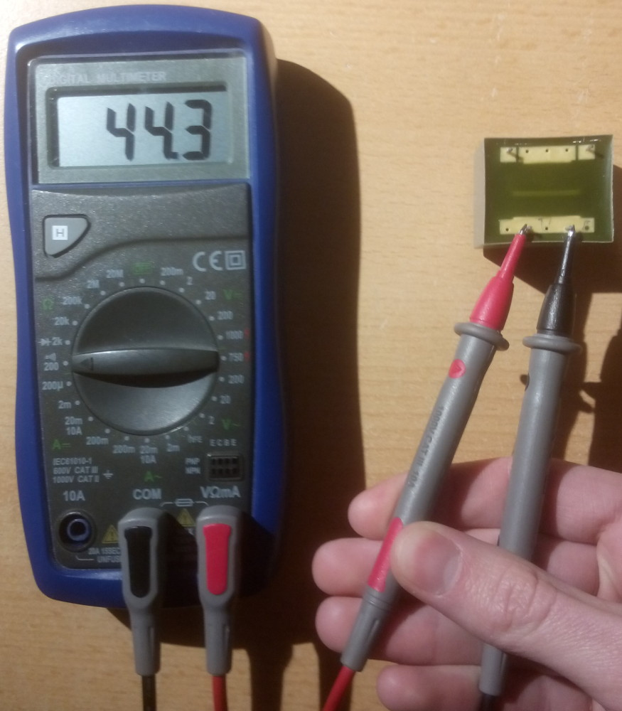
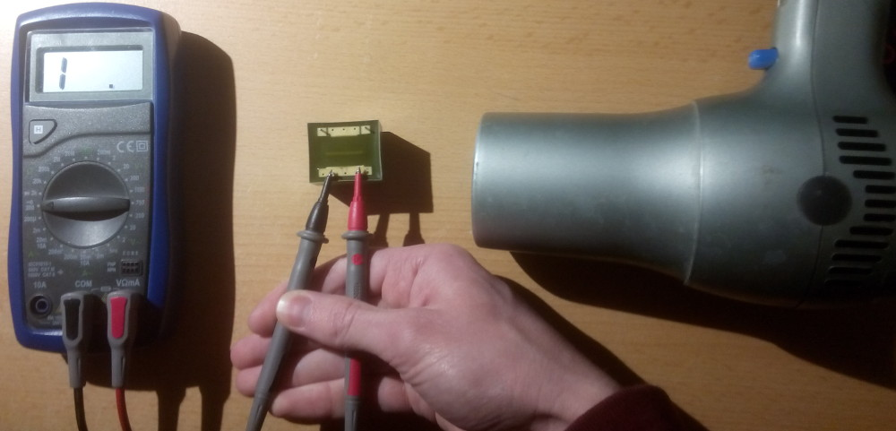
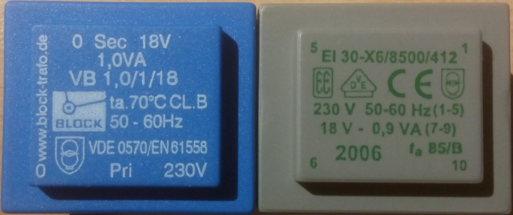
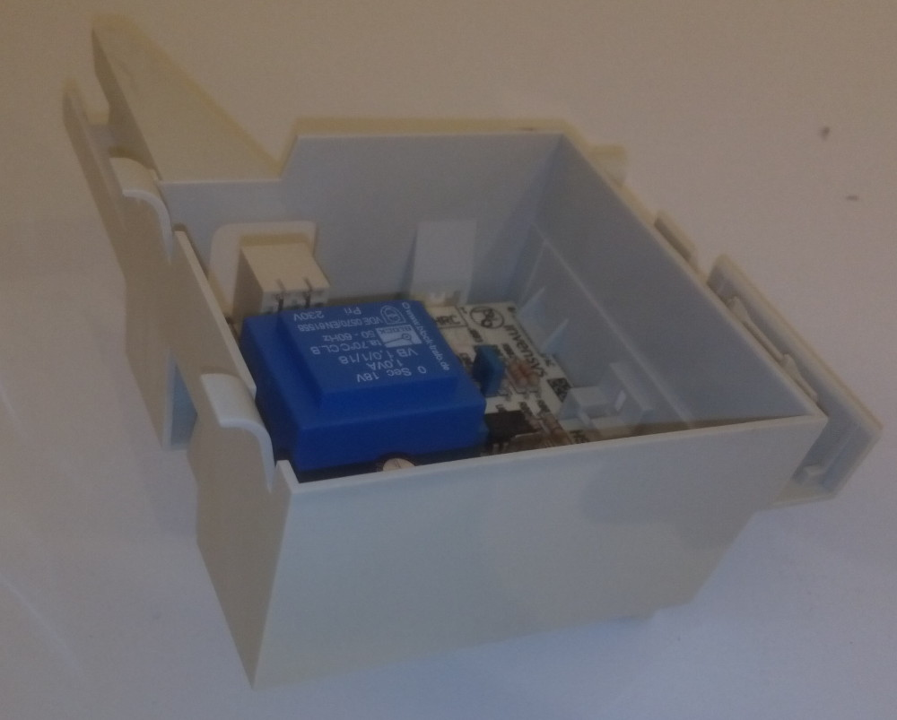
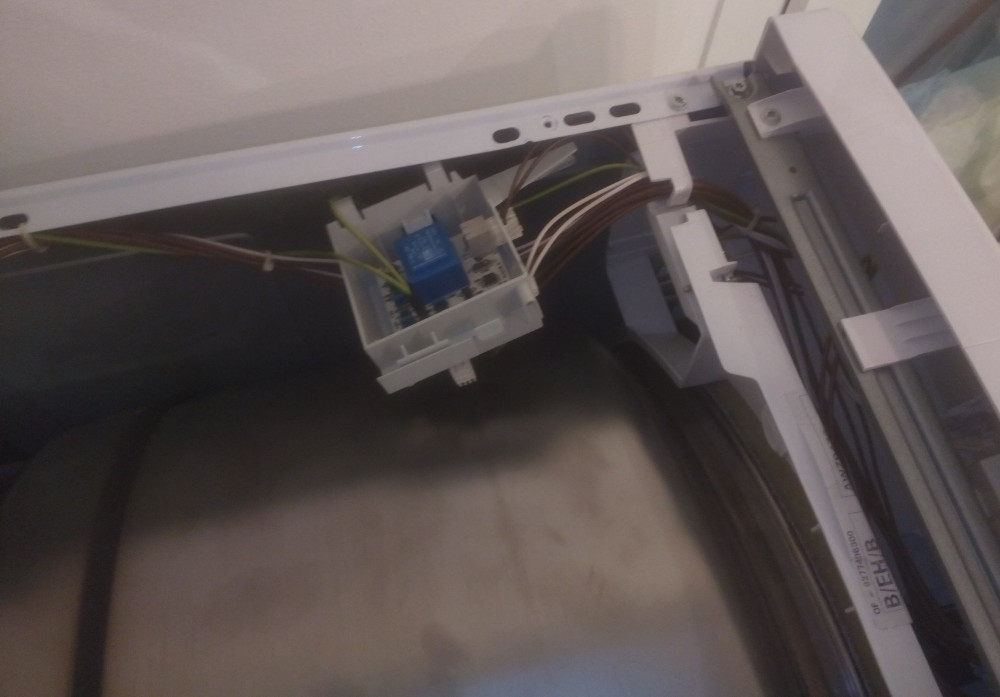
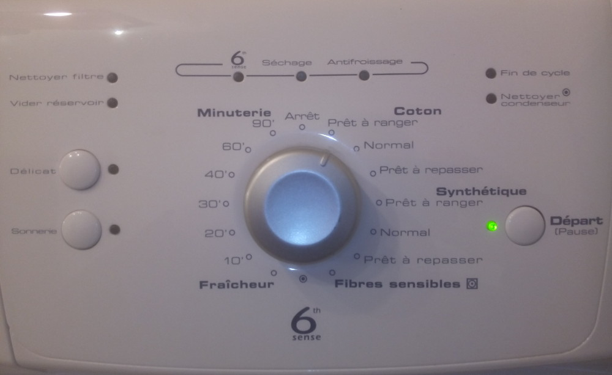

## Introduction

Recently my tumble dryer showed an error and refused to dry. It is a Whirlpool AWZ 8476 from 2006, so it has nearly 10 years of good and loyal service! But throwing it right away is not my style.

## What does the error code means?

The error is the following: 4 green leds are on, 3 red one are blinking.

After some researches on the internet here I found that what the leds are meaning. It is the error code “F15/FF humidity detection system failure” which can be caused by:

* humidity sensor failure
* temperature sensors failure

Knowing that the temperature sensors have there own error code I was pretty sure it was the humidity sensor. But what does it look like? It is the two metal bars near the filter.

{ width=32% }
{ width=32% }

## Identify the failure

I don’t really see how metal bars could fail. There is probably some electronic behind which is failing. After removing the hood I saw that the metal bars are connected to a box on the side of the machine. The box is holding a electronic card which has two other connectors.

So we have 3 connectors:

* a big one made of plastic: the power supply (230V)
* “HS” where the metal bars are connected
* “HRC” connected to the main board. It is the signal to tell the main board if the content of the dryer is dry

After a quick check of the board none of the usual components seemed to be broken (diodes and capacities).

When I removed the hood just after the machine showed the error I noticed that the transformer (grey box) was quite hot. On transformer that are quite old there is a possibility that the isolation of the coils is damaged. So I decided to check the coils after unsolder the transformer.

By ambient temperature the internal resistance of the coils seems to be okey. But after heating the transformer the resistance on the secondary side (output) becomes infinite.

This means that the coil is open and the transformer can not work properly. The rest of the board is not powered and the sensor can not work.

{ width=32% }
{ width=32% }
{ width=32% }

## Replacing the transformer

I brought a new similar transformer for less than 5€.

The characteristics are very similar, only the maximum working temperature (ta) is a bit lower. Nevertheless it should work.

{ width=32% }
{ width=32% }

## Test

Once the board back in the box and connected to the rest, I just have to test my work.

The error code disappeared and I can use my dryer again!

{ width=32% }
{ width=32% }

This article has also been posted on [instructables](https://www.instructables.com/Repairing-a-Whirlpool-AWZ-8476-Tumble-Dryer/){ target="_blank" }.